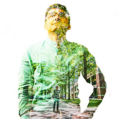
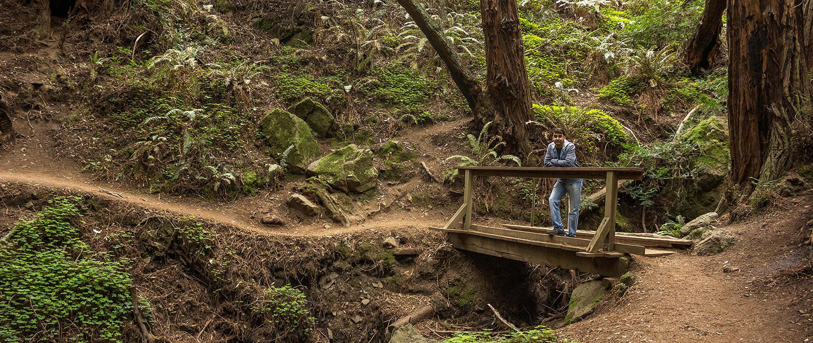

Tanmay Thakur
=============

...... & Photographer

-   [Latest](#latest)
-   [Landscapes](#landscapes)
-   [Life](#life)
-   [Travel](#travel)
-   [Macro](#macro)
-   [Art](#art)
-   [About Me](#aboutme)

-   [Facebook](https://www.facebook.com/addingcolorstopixels)
-   [Flickr](https://www.flickr.com/photos/tanmaythakur2/sets/)
-   [Instagram](https://www.instagram.com/tanmaythakur2/)

About Me
--------

I am Tanmay Thakur, a self taught photographer and a software engineer by profession. Challenge me with cool photography projects. Shooting the Northern Lights is on my checklist. I don't own any expensive gear. I have Canon T3i with basic lenses. I prefer to touch up photos in Lightroom.

I would love to hear your views about my work. Let's connect on my [fb page 'Adding Colors to Pixels'](https://www.facebook.com/addingcolorstopixels).

-   
-   
-   

-   © Adding Colors to Pixels

-   © TanmayThakur 2018

